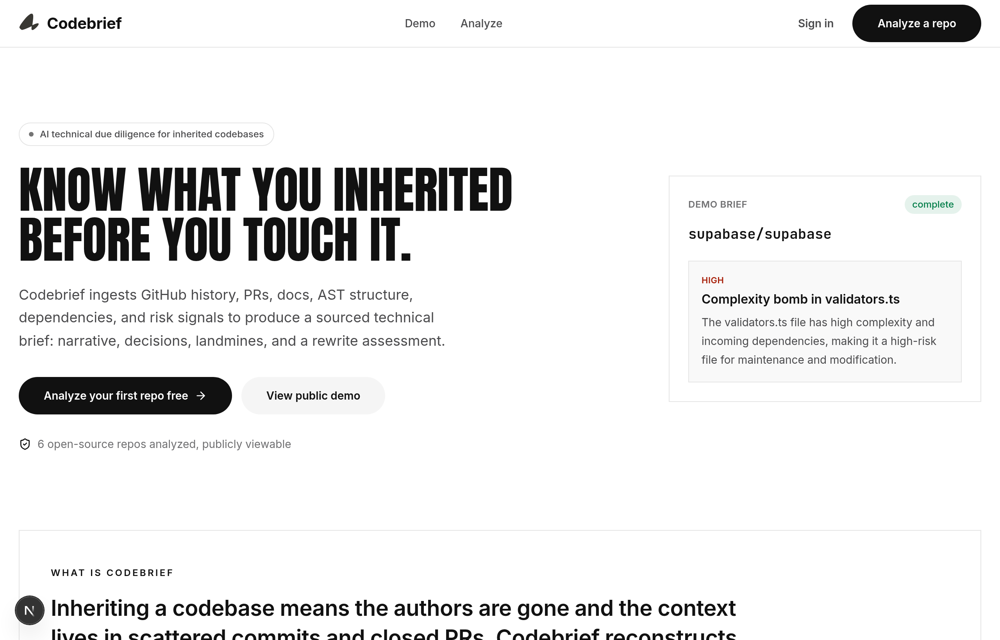
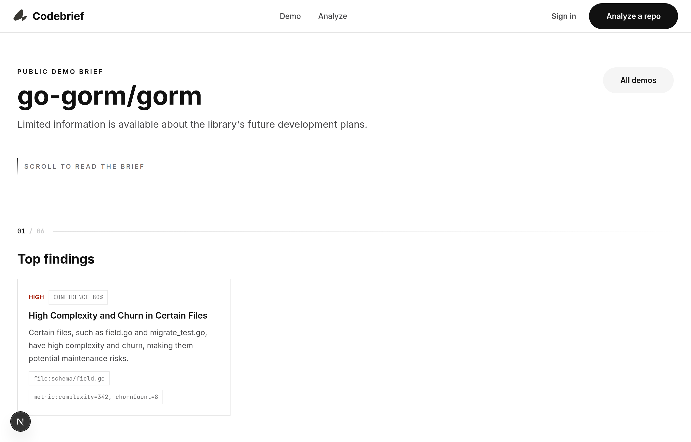
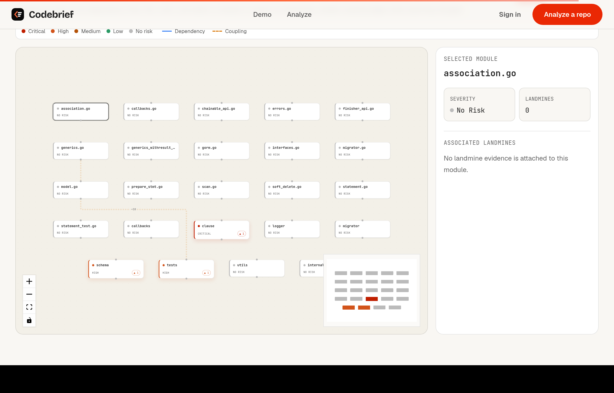
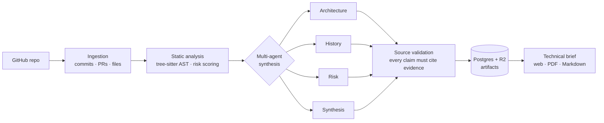

<div align="center">

<picture>
  <source media="(prefers-color-scheme: dark)" srcset="assets/codebrief-wordmark-dark.svg" />
  
</picture>

### Know what you inherited before you touch it.

**Codebrief** turns a GitHub repository into an evidence-backed technical brief — system narrative, decision archaeology, a landmine map, and a rewrite assessment — so you can take over an unfamiliar codebase with confidence.

[](LICENSE)
[](https://nextjs.org/)
[](https://www.typescriptlang.org/)
[](https://orm.drizzle.team/)
[](https://docs.bullmq.io/)
[](https://build.nvidia.com/)

[Live demo](#-live-demo) · [How it works](#-how-it-works) · [Quick start](#-quick-start) · [Tech stack](#-tech-stack)

</div>

<br />

<div align="center">
  
</div>

<br />

## Overview

Inheriting a codebase is one of the riskiest moments in software: the original authors are gone, the context lives in scattered commits and closed PRs, and the README rarely tells you where the bodies are buried. **Codebrief reconstructs that missing context automatically.**

Point it at a repository and a multi-agent pipeline ingests the Git history, parses the source with tree-sitter, scores risk, and synthesizes a structured brief where **every claim cites the commit, PR, file, or metric it came from**. No hand-wavy summaries — just sourced, auditable findings.

> [!NOTE]
> Codebrief is **free and open source**. Public demo briefs require no account.

## Table of contents

- [What you get](#-what-you-get)
- [Live demo](#-live-demo)
- [How it works](#-how-it-works)
- [Tech stack](#-tech-stack)
- [Project structure](#-project-structure)
- [Quick start](#-quick-start)
- [Verification](#-verification)
- [Scripts reference](#-scripts-reference)
- [License](#-license)

## ✦ What you get

Every analysis produces a single, scrollable brief with sourced sections:

| Section | What it answers |
| --- | --- |
| **System narrative** | A business-level explanation of what the system does, its data model, and architecture pattern — with citations. |
| **Decision archaeology** | Why the codebase looks the way it does, reconstructed from commits, PRs, and discussion threads. |
| **Landmine map** | The risky files and patterns — severity, why they matter, remediation, and effort estimates. |
| **Rewrite assessment** | A grounded *build-on vs. rewrite* verdict with reasons, risks, and an explicit uncertainty statement. |
| **Architecture diagram** | An interactive dependency graph; select any module to inspect its coupling and landmines. |
| **Grounded Q&A** | Ask follow-up questions answered only from the analyzed evidence. |
| **Exports** | One-click **PDF** and **Markdown** for sharing with stakeholders. |

<div align="center">
  
  
</div>

<div align="center">
  <em>Scroll-driven storytelling brief (left) · interactive architecture diagram (right)</em>
</div>

## ✦ Live demo

Pre-generated briefs for well-known open-source projects are publicly viewable — no sign-in required:

```
/demo           → gallery of demo briefs
/demo/[slug]    → a full brief (e.g. /demo/gorm, /demo/supabase, /demo/django)
```

Run the app locally (see [Quick start](#-quick-start)) and open <http://localhost:3000/demo>.

## ✦ How it works

Codebrief runs a sequential, durable pipeline. Each stage persists its output before the next begins, so a failed run can be retried with clean inputs and live progress streams to the UI over websockets.



**Grounding is enforced, not hoped for.** After every agent call, outputs are validated against their citations. Invalid citations trigger one correction retry; claim-like output that still can't be sourced is downgraded to `confidence: 0` rather than shipped as fact. Unrecoverable output fails the analysis instead of polluting the brief.

## ✦ Tech stack

| Layer | Technology |
| --- | --- |
| **Web** | Next.js (App Router), React, Tailwind CSS, Framer Motion |
| **Auth** | Clerk |
| **AI** | NVIDIA NIM (OpenAI-compatible SDK) — multi-agent, serialized with backoff |
| **Pipeline** | Node worker, BullMQ on Redis |
| **Code analysis** | tree-sitter (TS/TSX, Python, Go, Ruby, …) |
| **Data** | PostgreSQL via Drizzle ORM |
| **Artifact storage** | Cloudflare R2 (S3-compatible) |
| **Realtime** | Socket.io progress streaming |
| **Exports** | Puppeteer (PDF), Markdown serializer |
| **Observability** | Sentry (browser · server · edge) |
| **Validation** | Zod schemas shared across web + pipeline |

## ✦ Project structure

This is an npm-workspaces monorepo.

```
codebrief/
├── apps/web/            # Next.js app: dashboard, analysis APIs, brief viewer, exports, demos
├── packages/pipeline/   # BullMQ worker: ingestion, AST, agents, validation, storage, websockets
├── shared/types/        # Zod schemas & TypeScript types (briefs, events, GitHub records)
├── src/m0/              # M0 spike: source validation, AST, risk scoring, agent-retry tests
├── drizzle/             # SQL migrations
└── assets/              # Brand assets & documentation screenshots
```

## ✦ Quick start

### Prerequisites

- **Node.js 20+** and npm
- A **PostgreSQL** database and a **Redis** instance
- API credentials: **Clerk** (auth), **GitHub** (OAuth + token), **NVIDIA NIM** (AI), **Cloudflare R2** (storage)
- *Optional:* a Chrome/Chromium binary for PDF export (`PUPPETEER_EXECUTABLE_PATH`)

### 1. Install

```bash
git clone https://github.com/sx4im/codebrief.git
cd codebrief
npm install
```

### 2. Configure

```bash
cp .env.example .env
```

Fill in `.env` with your Clerk, GitHub, Postgres, Redis, NVIDIA NIM, and R2 values. No secrets are hardcoded — the app surfaces explicit configuration errors instead of faking output when credentials are missing.

### 3. Migrate the database

```bash
npm run db:migrate
```

### 4. Run

Start the web app, the pipeline worker, and the websocket progress server in separate shells:

```bash
npm run dev:web      # http://localhost:3000
npm run dev:worker   # BullMQ analysis worker
npm run dev:ws       # Socket.io progress server
```

Open <http://localhost:3000>, browse the demos, or start a live analysis from `/projects/new`.

Check deployment readiness without exposing secrets:

```bash
curl http://localhost:3000/api/health
curl http://localhost:3000/api/health?deep=1
```

## ✦ Verification

All gates pass on a clean checkout:

```bash
npm run typecheck          # tsc across every workspace
npm test                   # pipeline + web unit/integration suites
npm run build -w apps/web  # production Next.js build
npm audit                  # dependency audit
```

PDF export is exercised end-to-end through the real route (`briefToHtml → puppeteer-core → Chrome`) when `PUPPETEER_EXECUTABLE_PATH` is set; otherwise the route cleanly falls back to HTML.

## ✦ Scripts reference

| Command | Description |
| --- | --- |
| `npm run dev:web` | Run the Next.js web app |
| `npm run dev:worker` | Run the BullMQ analysis worker |
| `npm run dev:ws` | Run the Socket.io progress server |
| `npm run db:migrate` | Apply database migrations |
| `npm run db:studio` | Open Drizzle Studio |
| `npm run pipeline:corpus -- --mode=dry-run --scope=quick` | Prepare the multi-language corpus manifest |
| `npm run pipeline:build-demo-briefs` | Regenerate the public demo briefs |
| `npm run typecheck` · `npm test` | Full verification |

## ✦ License

[MIT](LICENSE) © 2026 Saim Shafique

<div align="center">
<br />
<sub>Built with care for the engineers who inherit what others left behind.</sub>
</div>
